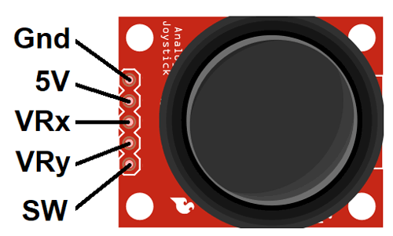

# Planning 2025-07-11

Let's finish our investigation of the firmware and make a plan for the claw
game.

## UI

The User interface seems to be managed by `Marlin/src/lcd/marlinui.cpp`

## Features we could exploit

- Joy stick (Do we have the pins?)
- Disable SD Card
- Enable Serial
- Disable Heaters?
- Disable 

## Goal of this project

Make a Claw game, which can be coin operated (eventually). Features are as
follows:

- Button to say start 
- Count down timer on start
- Button to say "go" (can be same as start button)
- Joystick to control position

I think this can work by:

1. Removing Thermistor connections (I think they're analog / ADC In connections)
2. Connecting up a joy stick 

Pretty simple?

## Joystick

Using an analog joystick, we can control the printer:

``` cpp
//#define JOYSTICK
#if ENABLED(JOYSTICK)
  #define JOY_X_PIN    5  // RAMPS: Suggested pin A5  on AUX2
  #define JOY_Y_PIN   10  // RAMPS: Suggested pin A10 on AUX2
  #define JOY_Z_PIN   12  // RAMPS: Suggested pin A12 on AUX2
  #define JOY_EN_PIN  44  // RAMPS: Suggested pin D44 on AUX2
  //#define INVERT_JOY_X  // Enable if X direction is reversed
  //#define INVERT_JOY_Y  // Enable if Y direction is reversed
  //#define INVERT_JOY_Z  // Enable if Z direction is reversed
  // Use M119 with JOYSTICK_DEBUG to find reasonable values after connecting:
  #define JOY_X_LIMITS { 5600, 8190-100, 8190+100, 10800 } // min, deadzone start, deadzone end, max
  #define JOY_Y_LIMITS { 5600, 8250-100, 8250+100, 11000 }
  #define JOY_Z_LIMITS { 4800, 8080-100, 8080+100, 11550 }
#endif
```

The thermister inputs are ADC inputs, so that should "just work." I think the
joy stick requires a 5V input:



## Custom Buttons

From [Stack Overflow](https://3dprinting.stackexchange.com/questions/18015/how-to-add-custom-physical-buttons-to-a-3d-printer-in-marlin-software):

Modern versions of Marlin (as of 2021) actually has built-in support for this
feature, using the Custom User Menu Buttons configuration items in
configuration_adv.h! Using the `#define CUSTOM_USER_BUTTONS` configuration
options, you can enable up to 25 hardware buttons, and configure each with
custom G-Code to implement the functionality you want.

One of the examples included in the default `configuration_adv.h` is actually
just about exactly what you asked about, starting preheating for one of the
preset filaments when enabled. Simply uncomment the first of the following lines
in the configuration file, and choose a hardware button to use.

``` cpp
#define CUSTOM_USER_BUTTONS
#define BUTTON1_PIN -1 // Set to the actual pin number
#define BUTTON2_PIN -1 // Set to the actual pin number

#if ENABLED(CUSTOM_USER_BUTTONS)

  // Auto Home
  #if PIN_EXISTS(BUTTON1)
    #define BUTTON1_HIT_STATE     LOW       // State of the triggered button. NC=LOW. NO=HIGH.
    #define BUTTON1_WHEN_PRINTING false     // Button allowed to trigger during printing?
    #define BUTTON1_GCODE         "G28"
    #define BUTTON1_DESC          "Homing"  // Optional string to set the LCD status
  #endif

  // Preheat Bed and Extruder
  #if PIN_EXISTS(BUTTON2)
    #define BUTTON2_HIT_STATE     LOW
    #define BUTTON2_WHEN_PRINTING false
    #define BUTTON2_GCODE         "M140 S" STRINGIFY(PREHEAT_1_TEMP_BED) "\nM104 S" STRINGIFY(PREHEAT_1_TEMP_HOTEND)
    #define BUTTON2_DESC          "Preheat for " PREHEAT_1_LABEL
  #endif

  // ...

#endif
```


